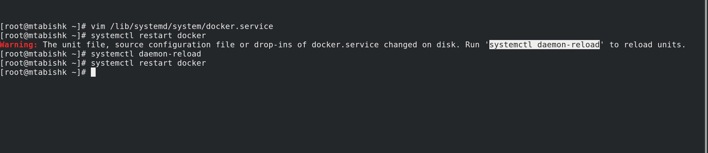
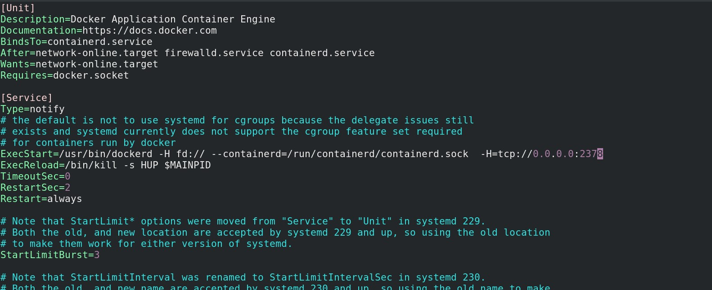

# Expose the Docker API (un-encrypted)
)
## Step 1: Edit /lib/systemd/system/docker.service file

## Step 2: Update ExecStart= ... -H=tcp://0.0.0.0:2378

## Step 3: Reload the daemon and restart the docker service

